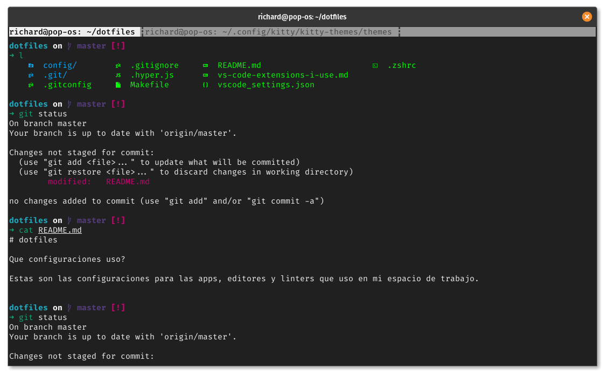
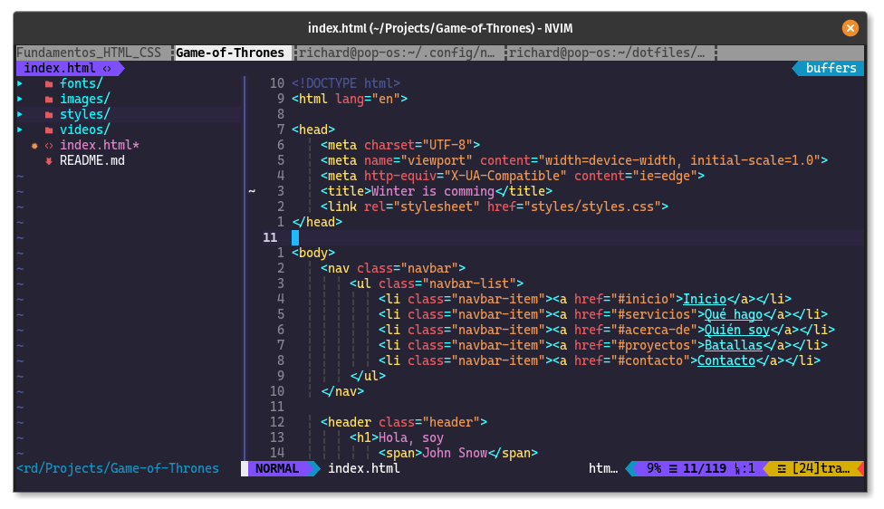

# My dotfiles

**Que configuraciones uso?**

Estas son las configuraciones para las apps, editores y linters que uso en mi espacio de trabajo específicamente linux (uso la distro [PopOS!](https://pop.system76.com/) de system76 basada en ubuntu).

## Si deseas probar mis configuraciones:

- Clona este repo en tu home, por ejemplo

```bash
git clone https://github.com/rpalaciosg/dotfiles ~/.dotfiles
```

- luego ejecuta el archivo `Makefile`,

```bash
cd ~/.dotfiles
make
```

Este comando ejecuta todos los apartados dentro del archivo `Makefile` tomando el statement por defecto `.ALL`

o

- Si deseas ir paso a paso, para verificar lo que se instala y crea; puedes ejecutar uno a uno cada statement del `Makefile`:

```bash
# 1 Statement de instalación
make install
# 2 statement de creación de enlaces simbólicos
make symlinks

```

## Capturas de Pantalla
### Kitty



### Neovim



## Probar con docker

> Muy pronto cargare la imagen y pasos para hacerlo

## Herramientas usadas

- [kitty](https://sw.kovidgoyal.net/kitty/) un emulador de terminal basado en GPU.
- [Kitty-themes](https://github.com/dexpota/kitty-themes) una colección de temas para kitty terminal.
- [zsh + ohmyzsh](https://github.com/ohmyzsh/ohmyzsh) como shell por defecto
- [Nerd-fonts](https://github.com/ryanoasis/nerd-fonts) para que caracteres de fuentes parcheadas tengan un bue aspecto (Actualmente estoy usando [Cascadia Code](https://github.com/microsoft/cascadia-code) de su repo original la variante `PL` antes usaba FiraCode)
- Ademas uso [JetBrains Mono](https://www.jetbrains.com/lp/mono/) y [FiraCode](https://github.com/ryanoasis/nerd-fonts/tree/master/patched-fonts/FiraCode) ambas tienen soporte con ligaduras.
- [Neovim](https://neovim.io/) como editor de texto y código con el tema [synthwave84](https://github.com/artanikin/vim-synthwave84) el cual también uso en VSCode.
- ...